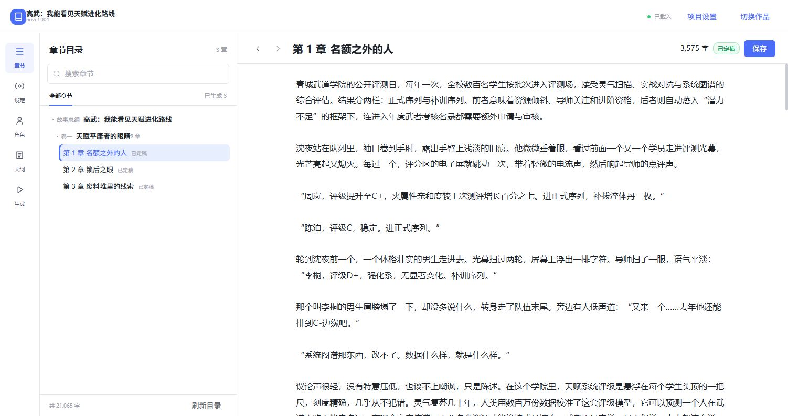
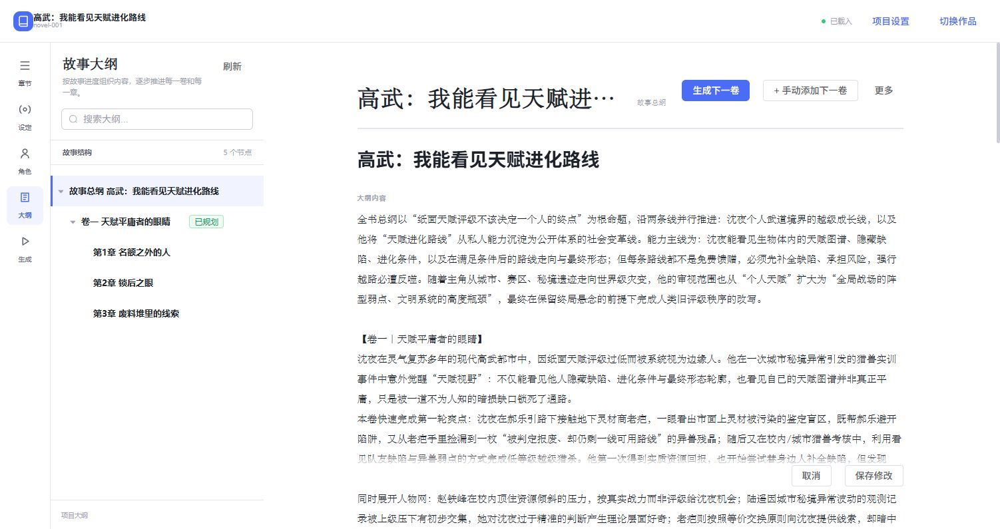
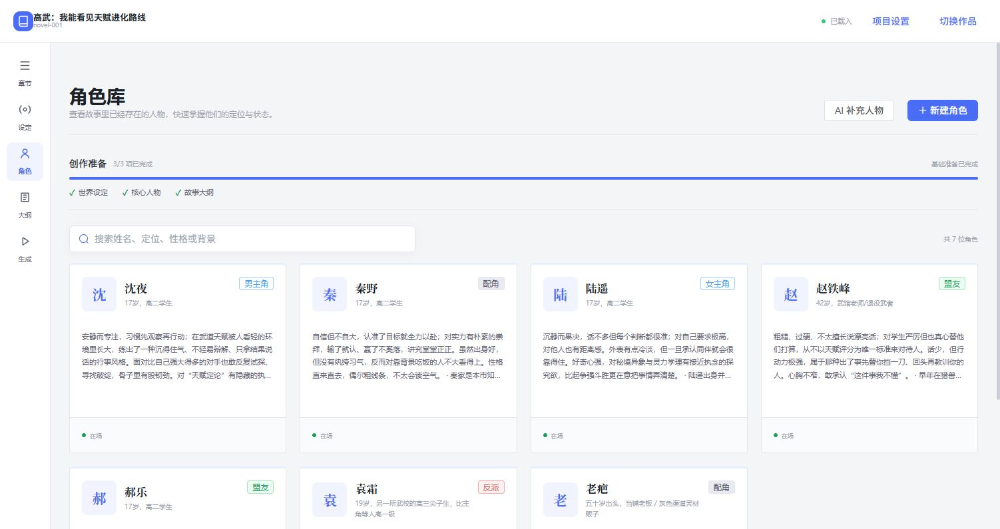
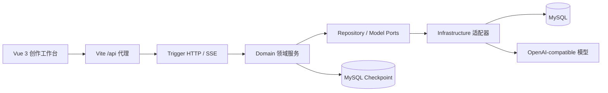

# Novel Agent

面向长篇小说持续创作的 AI Agent 工作台。把写一章拆成可恢复的规划、生成、审核、改稿、记忆压缩和持久化流程，并提供 Vue 3 创作界面。

## 本次更新（2026 年 9 月）

- 增加 Memory V1：定稿章节提取有正文证据的事件、事实和未完成线索，写入 Canonical Memory；下一章按相关性和预算读取，减少重复确认和无关历史干扰。
- 重构章节审核：先准备相关上下文，再分别检查连续性与文本质量；只对必须修复的问题定向改稿，并在最多两轮修改后做回归检查或交给人工处理。
- 完善生成会话恢复、章节计划衔接和创作工作台交互，增加记忆召回与模型调用指标，便于观察长流程运行情况。

**测试结果：**本次公开快照的 31 项定向测试全部通过，前端生产构建通过；六章记忆闭环回放中，第 11～15 章新写入的 Canonical Memory 均被下一章召回。真实模型对已完成的第 14、16 章进行审核回放：第 16 章的硬冲突误报由 2 次降为 0 次，自动改稿由 3 轮降为 0 轮；两章合计审核 token 从旧流程至少 226,200 降至 73,418（按旧流程下界计算，减少至少 67.5%）。第 14 章的目标人物位置冲突仍漏检，最终转人工处理，因此当前效果结论仅适用于这两章回放，不代表整体小说质量已提升。

## 能做什么

- 维护故事设定、规则和写作风格；
- 管理角色档案，并让模型补充人物草稿；
- 按“全书 → 分卷 → 章节”的层级推进大纲；
- 生成章节初稿，检查连续性和文本质量，定向改稿并做回归检查，必要时交给人工确认；
- 将定稿章节转为可追溯的长期记忆，并保留短期记忆和故事状态，支持跨章连续性；
- 使用 MySQL Checkpoint 恢复长流程，使用 SSE 接收生成进度；
- 查看章节正文、编辑内容、更新章节记忆。

## 前端预览

### 章节阅读工作台



### 故事大纲



### 角色库



## 系统架构



一次章节生成的主要路径是：

```text
LOAD_CONTEXT → DRAFT → PREPARE_REVIEW_CONTEXT
             → CONTINUITY_VALIDATION → QUALITY_REVIEW → REPAIR_PLAN
                    ├─ 无必修问题 → COMPRESSION → PERSIST
                    └─ 定向改稿 → REGRESSION_CHECK
                                   ├─ 通过 → COMPRESSION → PERSIST
                                   └─ 未解决 → 再改稿 / 人工处理
```

### 模块职责

| 模块 | 职责 |
| --- | --- |
| `novel-agent-web` | Vue 3 + TypeScript + Element Plus 前端工作台 |
| `novel-agent-api` | 对外 DTO、Command、Response |
| `novel-agent-trigger` | Controller、SSE、Generation Session、异常边界 |
| `novel-agent-domain` | 故事规划、章节 Agent、领域模型和端口 |
| `novel-agent-infrastructure` | Spring AI、MyBatis、MySQL、Checkpoint、Trace |
| `novel-agent-types` | 通用类型、异常和响应结构 |
| `novel-agent-app` | Spring Boot 启动类、配置和依赖装配 |

## 目录结构

```text
novel-agent/
├── novel-agent-api/
├── novel-agent-app/
│   └── src/main/resources/
│       ├── application.yml
│       ├── application-dev.yml
│       ├── application-prod.yml
│       ├── application-stress.yml
│       └── mybatis/
├── novel-agent-domain/
├── novel-agent-infrastructure/
├── novel-agent-trigger/
├── novel-agent-types/
├── novel-agent-web/
│   ├── src/
│   └── public/              # 前端静态资源，目前为 favicon.svg、icons.svg
├── docs/
│   ├── images/               # README 使用的前端截图
│   ├── sql/                  # schema.sql、seed.sql
│   ├── chapter-workflow.md
│   └── database-design.md
└── README.md
```

`novel-agent-web/public` 是 Vite 的静态资源目录，不承载项目公开信息、小说业务数据或数据库脚本。项目截图统一放在 `docs/images`，数据库脚本统一放在 `docs/sql`。

## 技术栈

- 后端：Java 17、Spring Boot 4.1、Spring AI 2.0、LangGraph4j 1.8、MyBatis、MySQL、Reactor、SSE、Maven；
- 前端：Vue 3、TypeScript、Vite、Pinia、Vue Router、Element Plus、Axios；
- 模型：Spring AI 的 OpenAI-compatible Chat 接口，可接入 DeepSeek 等兼容服务。

## 快速启动

### 1. 环境要求

- JDK 17+
- Maven 3.8+
- Node.js 20+ 和 npm
- MySQL 8+
- 一个可用的 OpenAI-compatible Chat API Key

### 2. 初始化数据库

先执行完整表结构：

```bash
mysql -uroot -p < docs/sql/schema.sql
```

如果需要演示数据，再执行：

```bash
mysql -uroot -p < docs/sql/seed.sql
```

`seed.sql` 写入的是 `demo-story` 演示项目。
SQL 脚本位于 `docs/sql`，应用不会通过 Spring Boot 自动初始化数据库。

### 3. 配置环境变量

公共配置在 `novel-agent-app/src/main/resources/application.yml`，通常不需要修改。启动开发环境时，Spring Boot 会叠加 `application-dev.yml`。

开发环境需要填写以下环境变量：

| 环境变量 | 用途 | 示例 |
| --- | --- | --- |
| `SPRING_DATASOURCE_URL` | MySQL JDBC 地址 | `jdbc:mysql://127.0.0.1:3306/novel_agent` |
| `SPRING_DATASOURCE_USERNAME` | MySQL 用户名 | `root` |
| `SPRING_DATASOURCE_PASSWORD` | MySQL 密码 | 仅在本机环境变量中填写 |
| `SPRING_AI_OPENAI_API_KEY` | 模型服务 API Key | 仅在本机环境变量中填写 |

PowerShell：

```powershell
$env:SPRING_DATASOURCE_URL = 'jdbc:mysql://127.0.0.1:3306/novel_agent?createDatabaseIfNotExist=true&useUnicode=true&characterEncoding=utf8&serverTimezone=Asia/Shanghai&allowPublicKeyRetrieval=true&useSSL=false'
$env:SPRING_DATASOURCE_USERNAME = 'root'
$env:SPRING_DATASOURCE_PASSWORD = '你的数据库密码'
$env:SPRING_AI_OPENAI_API_KEY = '你的模型 API Key'
```

Bash / macOS / Linux：

```bash
export SPRING_DATASOURCE_URL='jdbc:mysql://127.0.0.1:3306/novel_agent?createDatabaseIfNotExist=true&useUnicode=true&characterEncoding=utf8&serverTimezone=Asia/Shanghai&allowPublicKeyRetrieval=true&useSSL=false'
export SPRING_DATASOURCE_USERNAME=root
export SPRING_DATASOURCE_PASSWORD='你的数据库密码'
export SPRING_AI_OPENAI_API_KEY='你的模型 API Key'
```

`application-prod.yml` 使用同一组 `SPRING_DATASOURCE_*` 和 `SPRING_AI_OPENAI_API_KEY` 环境变量。`application-stress.yml` 也使用同一组数据库环境变量，连接地址由 `SPRING_DATASOURCE_URL` 指定。

### 4. 启动后端

在项目根目录执行：

```bash
mvn -pl novel-agent-app -am package -DskipTests
java -jar novel-agent-app/target/novel-agent-app.jar --spring.profiles.active=dev
```

后端地址：`http://localhost:18091`

### 5. 启动前端

另开一个终端：

```bash
cd novel-agent-web
npm install
npm run dev
```

前端地址：`http://localhost:5173`

前端 Vite 会把 `/api` 请求代理到 `http://localhost:18091`。如果后端端口发生变化，请同步修改 `novel-agent-web/vite.config.ts`。

### 6. 加载项目并开始创作

1. 打开 `http://localhost:5173`；
2. 在“项目设置”中选择“加载项目”；
3. 输入项目代号，例如 `novel-001` 或执行 `seed.sql` 后使用 `demo-story`；
4. 按“设定 → 角色 → 大纲 → 生成 → 章节”的顺序推进；
5. 首次执行 AI 生成操作时才会实际调用模型服务。

## 常用命令

```bash
# 后端多模块编译打包
mvn -pl novel-agent-app -am package -DskipTests

# 前端生产构建
cd novel-agent-web
npm run build

# 前端生产预览
npm run preview
```

测试代码统一位于 `novel-agent-app/src/test`。修改测试后请按本次改动运行定向测试，不要默认执行全量测试。

## 相关文档

- [章节生成工作流](docs/chapter-workflow.md)
- [数据库设计](docs/database-design.md)
- [数据库初始化脚本](docs/sql/schema.sql)
- [演示数据脚本](docs/sql/seed.sql)

## 注意事项

- 不要将 API Key、数据库密码或本地私有配置提交到 Git；
- 开发、生产环境统一通过 `application-*.yml` 和环境变量切换，不新增供应商专属 Spring Profile；
- 生成章节属于长流程操作，Review 失败或需要人工处理时，可从已有 Session / Checkpoint 继续；
- 如果页面提示无法连接后端，先确认后端已启动并监听 `18091`，再检查 MySQL 连接和前端代理配置。
