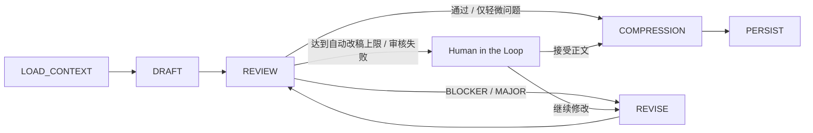
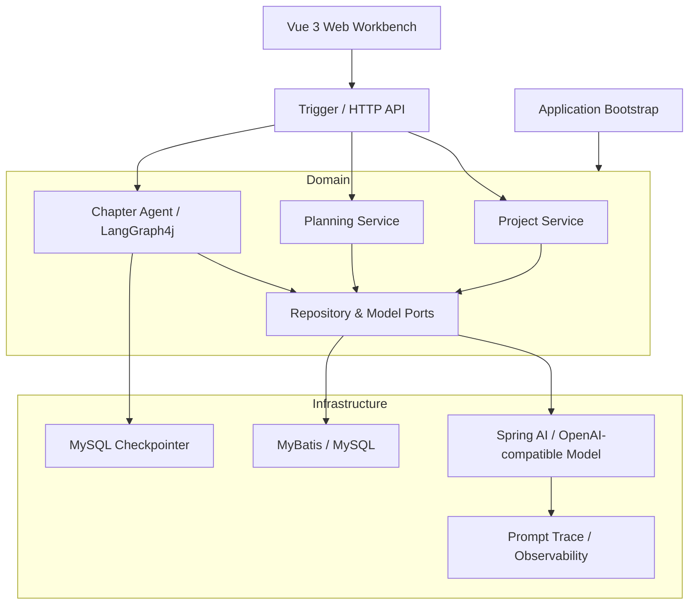

# Novel Agent

> 面向长篇小说持续创作场景的 AI Agent 工作台：从故事设定、角色与分层大纲，到章节生成、质量审核、迭代改稿、记忆压缩与持久化，构建可持续推进、可恢复、可人工干预的创作工作流。

## 项目简介

长篇小说生成不是一次 Prompt 调用能够解决的问题。随着章节持续增加，系统需要同时处理：

- 世界观、角色设定与剧情规划之间的一致性；
- 长上下文不断膨胀带来的成本与噪声；
- 初稿质量不稳定，需要自动审核与定向改稿；
- 长流程模型调用失败后能够恢复，而不是整章重新生成；
- 人工需要在关键节点介入，而不是完全放弃 Agent 的自动化能力。

Novel Agent 将小说创作拆分为 **Planning** 与 **Chapter Agent** 两层：前者负责 Story Bible、角色、卷/故事弧/章节计划等结构化规划；后者基于确认后的章节计划执行正文生成，并通过状态图完成审核、改稿、记忆压缩与持久化。

当前 `rootagent` 分支同时提供 Spring Boot 后端与 Vue 3 创作工作台，可完成从项目设定到章节阅读、生成与人工干预的完整链路。

## 核心能力

### 1. 分层故事规划

系统不会把“写小说”压缩成一个超长 Prompt，而是逐层建立长期创作约束：

```text
Project
  ├── Story Bible
  ├── Characters
  └── Outline Tree
        ├── Volume
        ├── Story Arc
        └── Chapter Plan
```

- **Story Bible**：维护世界背景、硬规则、核心主题、主冲突、结局方向与文风约束；
- **角色设定**：维护角色静态信息，并在规划时筛选与当前剧情真正相关的角色；
- **分层大纲**：支持根大纲、卷级规划、后续章节规划与故事弧重生成；
- **章节计划**：正文生成前先确认当前章节的目标和剧情摘要，避免模型边写边临时规划导致主线漂移。

### 2. 有状态章节 Agent

章节生成由 LangGraph4j 组织为可恢复的状态工作流：



工作流的主要节点包括：

| 节点 | 职责 |
| --- | --- |
| `LOAD_CONTEXT` | 加载 Story Bible、章节计划、近期记忆、上一章正文与最新状态快照 |
| `DRAFT` | 根据已确认计划生成章节初稿 |
| `REVIEW` | 从连续性、人物、世界规则、剧情推进、重复信息、文风等维度输出结构化审稿结果 |
| `REVISE` | 只针对有证据的问题定向修改，并进入 Review → Revise 循环 |
| `COMPRESSION` | 将完整正文压缩为后续章节真正需要的短期记忆和状态快照 |
| `PERSIST` | 在事务中保存正文、记忆、状态与项目进度 |

### 3. Review → Revise 自动质量闭环

审核并不是简单返回一个分数。`REVIEW` 会生成结构化问题，并根据问题严重程度决定是否需要改稿。

- `BLOCKER / MAJOR`：进入 `REVISE`，修改后重新审核；
- `MINOR`：允许继续后续流程；
- 自动改稿达到上限仍未解决：进入人工确认；
- 审稿模型输出校验连续失败：保留当前正文并进入可恢复检查点，而不是丢失整次生成结果。

这样可以把“模型偶尔写坏一章”从一次性失败，转化为可观察、可修复的工作流状态。

### 4. 长篇上下文与记忆压缩

系统不会在每一章都把完整历史正文重新塞给模型。

`LOAD_CONTEXT` 主要组合：

- Story Bible 中与当前创作有关的约束；
- 当前章节已确认的 Chapter Plan；
- 最近章节的 `ChapterMemory`；
- 上一章定稿正文；
- 最新 `StoryStateSnapshot`；
- 与当前剧情相关的角色静态设定。

章节完成后，`COMPRESSION` 从正文中生成两类长期信息：

**ChapterMemory**

- `shortSummary`：本章核心推进；
- `keyEvents`：会影响后续因果的关键事件；
- `unresolved`：正文已经提出但尚未解决的问题；
- `endingHook`：下一章需要承接的明确钩子。

**StoryStateSnapshot**

- `resources`：重要资源 / 物品状态；
- `abilities`：能力、伤势、限制与掌握程度；
- `knowledge`：角色已经知道或仍不知道的重要信息；
- `presence`：地点、登场与离场等连续性状态。

历史剧情与当前状态分开维护，减少完整历史持续注入造成的上下文膨胀，同时降低人物“突然知道信息”、资源凭空恢复、地点无原因跳变等连续性错误。

### 5. Human in the Loop 与 Checkpoint

长流程模型调用中，自动化和人工控制并不是二选一。

系统支持在可恢复检查点暂停章节工作流，并保留当前 Draft、ReviewReport、Revision 等状态。人工可以：

- 接受当前正文并继续；
- 提供新的修改意见后继续改稿；
- 重新触发审核；
- 终止当前生成流程。

工作流状态可持久化到 MySQL，服务恢复后能够继续已有生成过程，而不是从头重新调用全部模型节点。

### 6. 生成过程可观察

章节生成通过 Generation Session 暴露运行状态，前端使用 SSE 实时接收生成事件与正文内容。

开发环境还提供模型调用 Trace，用于记录：

- 当前 workflow / stage；
- Prompt；
- 模型原始响应；
- 重试次数；
- 调用耗时；
- 输出解析或模型调用失败信息。

配合结构化输出校验、模型重试和流式异常分类，可以更容易定位“Prompt 问题、模型问题还是工作流问题”。

## 系统架构



后端采用 DDD 风格的多模块结构，将领域编排与外部实现解耦。Domain 层只依赖端口，模型调用、数据库、Checkpoint 与日志追踪由 Infrastructure 实现。

## 工程结构

```text
novel-agent
├── novel-agent-api             # 对外接口 DTO / Command / Response
├── novel-agent-app             # Spring Boot 启动、配置与依赖装配
├── novel-agent-domain          # 核心领域模型、Planning、Chapter Agent、端口
├── novel-agent-trigger         # Controller、SSE、Generation Session 等入站适配
├── novel-agent-infrastructure  # Spring AI、MyBatis、MySQL Checkpoint、Trace 等实现
├── novel-agent-types           # 通用类型、异常与响应结构
├── novel-agent-web             # Vue 3 + TypeScript 创作工作台
└── docs                        # 工作流、数据库设计与实施文档
```

## 技术栈

### Backend

- Java 17
- Spring Boot 4.1
- Spring AI 2.0
- LangGraph4j 1.8
- MyBatis
- MySQL
- Project Reactor / SSE
- Maven

模型层基于 Spring AI 的 OpenAI-compatible 接口，当前开发配置可接入 DeepSeek 等兼容模型。

### Frontend

- Vue 3
- TypeScript
- Vite
- Pinia
- Vue Router
- Element Plus
- Axios

## Web 工作台

前端围绕长篇创作流程组织，而不是只提供一个 Prompt 输入框。目前包含：

- 项目与初始设定；
- Story Bible / 角色设定；
- 大纲与章节规划；
- 章节生成工作台；
- 章节目录、正文阅读与导航；
- Generation Session 状态与人工处理入口。

## 快速开始

### 1. 环境要求

- JDK 17+
- Maven 3.8+
- MySQL 8+
- Node.js / npm

### 2. 初始化数据库

应用不会自动执行建表脚本，需要先手动初始化：

```text
docs/sql/schema.sql
```

如需本地演示数据，可额外执行：

```text
docs/sql/seed.sql
```

### 3. 配置模型与数据库

开发配置位于：

```text
novel-agent-app/src/main/resources/application-dev.yml
```

请根据本地环境配置 MySQL 与 OpenAI-compatible 模型服务。**不要将真实 API Key 提交到仓库，建议通过环境变量或本地私有配置注入。**

### 4. 启动后端

```bash
mvn clean test
mvn -pl novel-agent-app -am spring-boot:run
```

开发环境默认监听：

```text
http://localhost:18091
```

### 5. 启动前端

```bash
cd novel-agent-web
npm install
npm run dev
```

前端默认运行在：

```text
http://localhost:5173
```

Vite 会将 `/api` 请求代理到本地 `18091` 后端服务。

## 关键设计取舍

### 为什么章节计划和正文生成分开？

正文模型负责“怎么写”，Planning 负责“这一章要发生什么”。计划先确认，可以降低正文生成时主线漂移，也让人工修改剧情方向不需要重写整套 Prompt。

### 为什么不用完整历史正文作为长期记忆？

长篇小说的上下文会线性增长，而真正影响下一章的历史信息远少于全文。将章节压缩为 `ChapterMemory + StoryStateSnapshot`，能够把剧情事实和当前有效状态保留下来，同时减少无关文本占用上下文。

### 为什么需要 Checkpoint？

一个章节可能包含多次长耗时模型调用。若 Review 或 Revise 阶段失败，重新执行前面已经完成的节点既浪费成本，也可能得到不同结果。Checkpoint 让工作流从明确状态继续执行。

### 为什么保留 Human in the Loop？

小说创作存在大量主观判断。Agent 适合处理重复性的生成、检查和修订，但剧情方向与最终文本不应完全交给自动路由，因此系统在自动改稿无法收敛或模型输出异常时将控制权交还给用户。

## 相关文档

- [章节生成工作流](docs/chapter-workflow.md)
- [数据库设计](docs/database-design.md)
- [数据库初始化脚本](docs/sql/schema.sql)
- [实现说明](docs/implementation-summary.md)

## 项目状态

`rootagent` 当前重点已经从单次章节生成扩展到完整的长篇小说 Agent 工作流，包括分层 Planning、章节状态图、自动审核与改稿、长期记忆压缩、可恢复 Checkpoint、人工干预、SSE Generation Session 与 Web 创作工作台。

项目仍在持续迭代，当前更关注 **长流程可靠性、上下文连续性和人机协作**，而不是单纯追求一次 Prompt 的生成效果。
