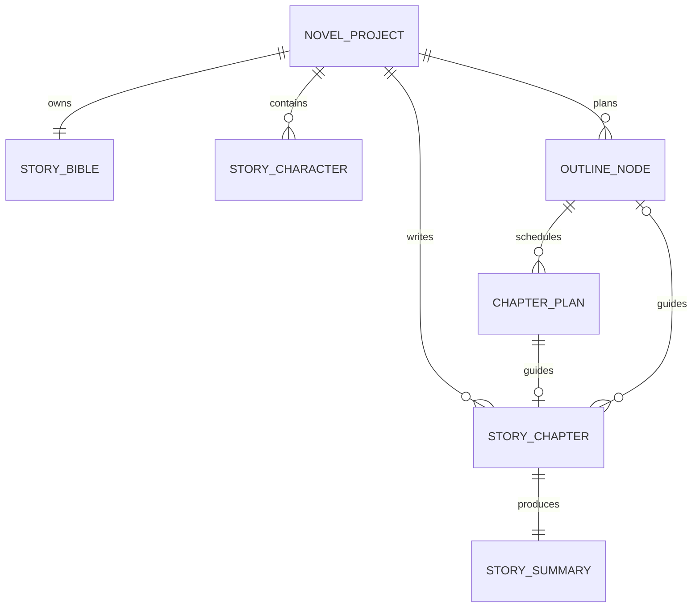

# 自动小说创作智能体数据库设计（七表 MVP）

> 文档状态：已落地  
> 更新时间：2026-09-02
> 数据库：MySQL 8.x  
> 业务模型：单一男主长篇网文  
> 建库建表：[schema.sql](sql/schema.sql)
> 开发种子数据：[seed.sql](sql/seed.sql)

## 1. 设计目标

当前阶段只保留能跑通“规划第一章 → 生成正文 → 生成章节记忆 → 章节记忆参与第二章生成”的数据。
任务调度、模型调用日志、正文历史版本和伏笔等能力等闭环验证后再拆表。

核心链路：

```text
小说项目 + 小说圣经 + 人物设定 + 分层大纲/章节卡
                    ↓
                 章节正文
                    ↓
        ChapterMemory + StoryStateSnapshot
                    ↓
              下一章上下文
```

## 2. 当前七张表

| 表名 | 职责 | 关键约束 |
| --- | --- | --- |
| `novel_project` | 小说项目、题材、生成进度 | `project_code` 唯一 |
| `story_bible` | 世界观、力量体系、硬规则、文风 | 每个项目一条 |
| `story_character` | 男主及其他复杂人物的人设和当前状态 | 项目内人物编号唯一；每项目最多一个男主 |
| `outline_node` | 书、卷、章级大纲节点 | 项目内节点编号唯一 |
| `chapter_plan` | 每章可执行的章节计划 | 项目内章节号唯一 |
| `story_chapter` | 当前章节正文 | 项目内章节号唯一，可重复生成覆盖 |
| `story_summary` | 每章 ChapterMemory 与当前 StoryStateSnapshot | 每章一条，可重复生成覆盖 |

`outline_node.node_kind` 只承载 `BOOK`、`VOLUME`、`ARC` 三种产品节点，固定层级为
`BOOK → VOLUME → ARC`。`ARC` 是章级大纲节点，不是 `ChapterPlan`；`ChapterPlan`
独立存储章节的可执行计划。

## 3. 关系



所有业务表通过 `project_id` 归属小说项目。核心归属使用物理外键，树结构的
`outline_node.parent_id` 由应用校验，避免大纲重排时产生复杂级联。

## 4. 人物与单男主约束

人物表收敛为作者维护的基础档案与独立生存状态，当前不拆能力、物品和人物关系表：

- `current_state_json` 仍保留为角色资料字段，但不由 ChapterMemory、PERSIST 或正文重同步更新；`life_status` 仍是人物表独立字段，不由记忆摘要推断。
- DRAFT、REVIEW、REVISE 使用正式人物静态设定、近期 ChapterMemory 和最近一次 StoryStateSnapshot；不将 `life_status` 作为正文 Prompt 的动态剧情状态。
- 章节关键事件和未解决问题分别存入 `story_summary.key_events_json` 和
  `unresolved_questions_json`。

`story_character` 通过生成列和唯一索引保证每个项目最多一个男主：

```sql
male_lead_project_guard BIGINT UNSIGNED
    GENERATED ALWAYS AS (
        CASE WHEN role_type = 'MALE_LEAD' THEN project_id ELSE NULL END
    ) STORED;

UNIQUE KEY uk_single_male_lead (male_lead_project_guard);
```

同时用检查约束保证 `MALE_LEAD` 的 `gender` 必须为 `MALE`。项目进入可生成状态前，
应用层还需校验恰好存在一名男主。

## 5. 多章串联数据

章节定稿时，在同一事务中：

1. 按 `(project_id, chapter_number)` 写入或覆盖 `story_chapter`。
2. 按来源章节写入或覆盖 `story_summary`。
3. 更新 `novel_project.current_chapter_number` 和章节卡状态。

删除最后一章时，只删除该章的章节记忆和正文，恢复对应 `ChapterPlan` 并回退项目进度。

人工修改正文时先提交正文并标记为 `DIRTY`、章节记忆标记为 `STALE`，随后自动通过 `COMPRESSION` 生成新的章节记忆；自动更新失败时正文保持已保存的 `DIRTY` 状态，允许再次更新。

生成下一章时读取当前章节之前最近若干章的 ChapterMemory、最近一次 StoryStateSnapshot，而不是把全部历史正文塞给模型。ChapterMemory 至少包含：

- 本章发生了什么；
- 关键事件及其结果；
- 尚未解决的问题；
- 章末钩子。

StoryStateSnapshot 只保留当前仍有效且容易遗忘的资源、能力、知识和出场状态；它表示“现在是什么状态”，不替代 ChapterMemory 的历史剧情记录。上一章正文只作为近距离衔接材料，长期连续性主要依靠两类结构化上下文。

## 6. JSON 与普通字段边界

需要唯一约束、排序和高频查询的内容使用普通字段，例如项目编号、角色类型、章节号、
状态和节点类型。结构容易变化且通常整体交给模型的内容使用 JSON，例如力量体系、硬规则、
男主变化和未解决问题。

`current_state_json` 为兼容保留的角色资料字段，不属于 ChapterMemory 契约；不由
ChapterMemory、PERSIST 或正文重同步更新，也不作为 DRAFT、REVIEW、REVISE 的剧情状态来源。

出现明确的检索、统计、转移流水或强一致性需求后，再将能力、物品、人物关系和伏笔
拆成独立表。

## 7. 章节生成指标

`generation_metrics` 按一次章节生成会话保存流程指标，使用
`(project_id, chapter_number, generation_session_id)` 作为复合主键。同一会话重复保存时
更新当前统计值，保留首次创建时间并由数据库自动维护最后更新时间。调用次数、修订轮数、
重试次数、DRAFT/REVIEW/REVISE/COMPRESSION 调用次数、耗时、Token 数和最终字数由生成流程写入；`generation_started_at`、
`generation_ended_at` 记录生命周期，`human_intervened` 表示流程中是否发生人工介入。
Token Usage 无法从模型响应取得时保持为空。

该表只依赖 `novel_project`，删除项目时应先删除对应指标记录。

## 8. 初始化与迁移

在项目根目录手动执行建库建表脚本；脚本自身会创建并切换到 `novel_agent` 数据库：

```bash
mysql -h127.0.0.1 -P13306 -uroot -p123456 < docs/sql/schema.sql
```

需要本地演示数据时再执行可重复运行的 seed 脚本：

```bash
mysql -h127.0.0.1 -P13306 -uroot -p123456 < docs/sql/seed.sql
```

`docs/sql` 只维护这两个入口。`schema.sql` 包含开发环境历史表清理和当前指标表结构兼容迁移语句，
当前表结构和初始化数据均以 ChapterMemory 与 StoryStateSnapshot 为章节连续性来源。

Spring Boot 不自动执行建表脚本。本地连接和 MyBatis 路径全部由 YAML 配置，服务端口为
`18091`。

## 9. 延后实现

- 正文历史版本与回滚；
- 伏笔和独立男主状态账本；
- 多章任务调度、步骤恢复和模型调用日志；
- 连续性问题表与自动修复；
- 能力、物品和人物关系独立建模。

这些能力只有在当前七表两章闭环稳定后再增加，避免提前维护无实际用途的表。
